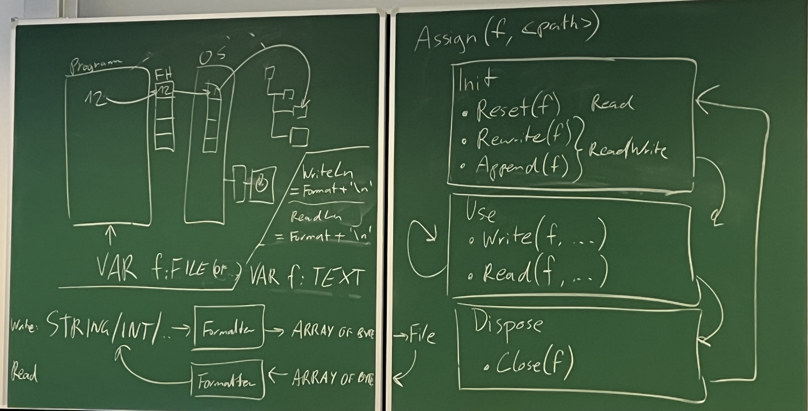

# Algorithmen und Datenstrukturen

## 29.2.2024

### Lehrplan

Hash und String Zeugs

Compilerbau, Gramatikanalyse

Objektorientiertes Programmieren

### Programme

3D Druck Simulation

Excel

### Suchalgorithmen

sequenzielle Suche O(n)
binäre Suche O(log n)

Ziel O(1)

Hashing

Schlüssel wird auf Inex in einem Array gemappt.(z.B. Modulo).

Kolisionen werden mithilfe von verkettung(jeder hashtabelleneintrag ist eine liste in der ich weitersuchen muss)

O Notation ist abhängig von der Hashmap Grö�e

Laufzeit vs. Speicherplatz

Offener Speicherbereich braucht Delete Flag

Vorsicht bei auswahl der hash methode

### Suchen in Zeichenketten

Einfache Lösung Drüberiterieren = O(n*m)

O(n+m) existiert

## 7.3.2024

### Datenkapselung

Module geben dem User nur die Proceduren die er benutzen dar zur verfügung, alle inneren Vorgänge und Datenstrukturen sind versteckt. wie private/public.

Verfügbare Procedures sind im Interface hinterlegt.

In pascal werden dazu Units verwendet. In einem Unit gibt es einen Implementierungs Teil und einen Interface Teil. Wenn sich etwas in der Implementierung �ndert muss man den Code der das Interface nutzt nicht ändern.

Man kann im Interface auch typen deklarieren.

Abstrakt => nicht direkt implementiert

## 8.3.2024

### Entwurf

Je mehr Gedanken um den Entwurf man sich vor der Implementierung macht, desto weniger Gedanken muss man sich nach der Implementierung machen.

Abstraktion, herunterbrechen herunterbrechen herunterbrechen.

#### Entwurfsebenen

Subsysteme mit schwacher Kopplung. Kommunizieren über Dateien, Datenbanken und Netzwerke

Diese bestehen aus Modulen mit enger Kopplung die über Aufrufschnittstellen kommunizieren.

Dies kann man noch auf einzelne Algorithmen zerbrechen.

Bespiel:

Compiler erzeugt aus .pas ein .o file, Linker erstellt daraus eine .exe.

Der Compiler wiederum besteht aus den Modulen Scanner, Parser, Symboltabelle und CodeGenerator. Der Scanner lest zeichen ab dem "BEGIN" ein, der Parser wertet die Gültigkeit aus und speichert Variablen in die Symboltabelle und der CodeGenerator erzeugt aus dem Code das Programm.

#### Zerlegungsarten

Man kann eine Anforderung auf 3 Weisen verbessern, je nach Anforderung gibt es gewisse Vor und Nachteile für jede Art.

Aufgabenorientiert.

Datenorientiert.

Objektorientiert.

#### Beispiel mit 3D Drucker

Parser

Instruktionen Speichern

Koordinaten definieren

Darstellung

Gerade linien

Kurven

in Schritte brechen

Validation der Instruktionen

Nutzeroberfläche

Linie Zeichen

Drucker zeichen

Editor

## 9.3.2024

Alle Ã?bungen machen.

### Hash table

#### List vs Array vs Tree

List vs Array vs Tree => Hashtable gewinnt

#### Hashen

kleines delta a => groÃ?es delta b

möglichst gleiche Verteilung

### Zeichenketten suchen

Vergleiche verschiedener Algorithmen, siehe Pascal Code.

## 13.4.2024

### Dateimanagement

Alles ist ein File, man kann auf Ger�te �ber spezielle Files zugreifen.

Standardfilehandles

0 => Stdout
1 => Stdin
2 => Stderr

Funktioniert bei jedem OS gleich
0, 1 und 2 kann man nicht closen.
Umleitungen wiederholt.

File of Typ

BlockRead und Write f�r Copy Programm.

### Abstrakte Datenstrukturen

Implementierung versteckt sich hinter einem Interface.
DOKUMENTATION

Stackbeispiel

## 11.5.2024

### Gramatik

Wieder die Frage, was ist eine Sprache?

Menge von Sätzen(endlich => auflistung, unendlich => Beschreibung für aufbau)

Satz => Konstrukt für Informationsübermittlung

Besteht aus Vokabeln/Symbole, die nach einer Gramatik aufgebaut sind und damit eine Semantik übermitteln

Das erste, dass ein Kind lernt ist Phonetik(Aussprache von Wörtern)

Danach erst die Semantik und am Schluss die Gramatik.

Zeichen müssen noch keinen Sinn ergeben

a + 3 => ungültig da wir keine Buchstaben haben

2 3 + => gültig da wir noch keinen Syntax haben

### Taschenrechner

Was sind undere Terminalsymbole/Klassen

Zahlen(Bestehen aus Ziffern, Terminalklasse),

Operationen(+-*/),

Klammern(())

Code ist auch in Repo

#### Nonterminal Symbole TR

Expr = Term { plus Term | minus Term }

Term = Fact { mult Fact | div Fact }

Fact = \[ +, - \] ( number | leftPar Expr rightPar )

## 18.5.2024

### Minipascal

#### Keywords MP

PROGRAM, BEGIN, END, VAR, READ, WRITE, INTEGER

#### Terminalklassen MP

ident = \[A-Za-z_\]\[A-Za-z0-9_\]*

number = \[0-9\]+

#### Einfache Terminalsymbole MP

semicolon ;

plus +

minus -

assign :=

mult *

div /

leftPar \(
  
rightPar \)

comma ,

period .

colon :

Assign ist ein eigens Zeichen statt eine Kombination aus : und =, da der Syntax so leichter und leserlicher wird und da man :{Line break}= verbieten kann.

### Nonterminal Symbole MP

MP = PROGRAM ident semicolon VarBlock BEGIN StatementSeq END period.

VarBlock = \[VAR Variable {Variable}\]

Variable = ident {comma ident} colon INTEGER semicolon.

StatementSeq = Statement { semicolon Statement }

Statement = \[ READ leftPar ident rightPar | WRITE leftPar Expr rightPar | ident assign Expr \]

Expr = Term { plus Term | minus Term }

Term = Fact { mult Fact | div Fact }

Fact = \[ +, - \] ( number | ident | leftPar Expr rightPar )

### Symbol Table MP

Wird verwendet um Variablen zu tracken. Code von Moodle.

## 25.5.2024

Heute Compiler

Infix, Präfix und Postfix rechnen

Stack TR exkurs

Befehlssatz der VM mit Stack, Storage, Program und Console

## 1.6.2024

Heit gibts ka Mitschrift weis mi net zaht hot lol.

## Übungen

### UE1

Zuerst muss eine string GetHashCode Funktion in einem Unit erstellt werden, diese rechnet einen Hashcode aus dem Ordinalwert eines chars und seiner Position aus, indem die Summe jedes Ordinalwertes mal 31 hoch der Position. Dieser Hasing Algorithmus wurde in der Übung kurz als die Lösung die Java verwendet angeschnitten.

Für die zwei verschiedenen Hash-Tabellen Arten werden 2 verschiedene Units(ChainedWordCounter und OpenAdressedWordCounter).

Das Hinzufügen der Wörter und die Kollisionsvermeidung wird gleich der Übung gemacht, wobei verschiedene Hashtabellengrößen getestet werden(die offen Adressierte Variante hat eine Untergrenze an gültiger Größe. Für die Testfälle wird eine Tabelle mit Zeiten erstellt um den Einfluss der Größe zur Laufzeit zu zeigen, weiters wird auch der genutzte Heap mittels heaptrc gezeigt.

Um die mehrfach vorkommenden Wörter zu zählen müssen zu jedem Wort die Anzahl an Vorkommnisse gespeichert werden. Dadurch kann später über alle Worte itteriert werden, um alle einmal vorkommenden Worte zu finden, die überbliebenen Worte zu Zählen und das Maximum zu finden.

Timer.pas wurde nicht verändert, in WordReader.pas wurde WinCrt entfernt, um das Unit Linux kompatibel zu machen, und der Word Datentyp wurde auf WordString geändert um Namenskonflikte mit dem Pascal Datentyp Word zu verhindern.

Per KI Richtlinie gebe ich bekannt CoPilot zu verwenden, wobei es zur Formatierung und als Autocomplete genutzt wurde.

Stunden 9

### UE2

1a
Da laut Angabe nur Strings mit gleicher Länge übereinstimmen können, kann man jedes Paar dessen Länge nicht übereinstimmt verwerfen und ab einem Unterschied den Vergleich, mit einem negativen Ergebnis, abbrechen. Nach der Annahme, dass jeder Input mit einem $ Symbol abschließt, werden alle Inputs nicht damit enden verworfen.

1b
In der Angabe ist der Lösungsweg schon fast zur Gänze beschrieben. Es wird ein Zeichen überprüft und wenn dieses übereinstimmt werden die ersten Zeichen der Strings enfernt und die Funktion wieder aufgerufen. Wenn das erste Zeichen ein \* Symbol ist wird die Funktion zweimal aufgerufen, einmal mit verkürztem und einmal mit gleichbleibendem Pattern. Es fehlt dann noch der Fall, dass \* für kein Zeichen steht, dieser kann geprüft werden indem man das Pattern kürzt und den Text gleich lässt.

2a
Jedes Zeichen des Strings wird in ein Array mit dem Indextyp Char hinzugefügt und der Zähler erhöht. Der Datentyp im Array ist Byte, obwohl für diese Aufgabe Boolean reichen würde, aber für die nächste Aufgabe wird eine Zahl benötigt. Byte wurde gewählt, da ein String nicht länger als 255 Zeichen sein kann, der Ausgabe Datentyp ist wie in der Angabe Integer. Wenn ein Zeichen davor schon in dem Array war wird der Zähler nicht mehr erhöht. Der Zähler wird am Ende ausgegeben. Der Ursprüngliche gedanke wäre eine Liste gewesen, da die Anzahl der Zeichen aber durch den Datentyp Char stark begrenz sind ist die implementierung eines Arrays einfacher und schneller.
Laut der Angabe werden unterschiedliche Zeichen gezählt, also wird angenommen, dass A nicht das selbe wie a ist.

2b
Vom ersten Zeichen an wird überprüft wieviele Zeichen nach rechts die M-Ketten Bedingung erfüllen, ab dem nächsten Zeichen wird links von der Kette abgezogen bis die Bedinging wieder erfüllt ist. Dieses Verfahren wird wiederholt bis man am Ende vom String ankommt. Die maximale Länge wird am Ende zurückgegeben.
Stunden: 9

### UE3

Ein LineBuffer wird erstellt, der alle hinzugef�gten STRINGS mithilfe einer verketteten Liste hintereinander h�ngt. Zuerst w�re eine Trennung der hinzugef�gten STRINGS, um den Platz des Buffers optimal auszunutzen, vorgesehen. Da aber durch das Read() eines Files 255 Zeichen lange STRINGS gelesen werden, mit der einzigen Ausnahmen am Ende einer Zeile, und da die Implementierung noch Fehler beinhaltete, wurde diese Behandlung wieder gestrichen.

Beim Lesen der Datei wird jede Zeile zuerst in den LineBuffer eingelesen und dann beim Schreiben skaliert, indem entweder jedes x-te Zeichen geschrieben wird oder jedes Zeichen x-mal geschrieben wird.

Die Skalierung in Y Richtung funktioniert �hnlich, nur statt Zeichen werden ganze Zeilen ansgelassen oder vervielfacht.

Eingabe Parameter werden durchlaufen und mit mehreren Verzweigungen �berpr�ft um die Optionalit�t und Reihenfolge der einzelnen Parametern zu gew�rleisten. Falls das Programm falsch aufgerufen wird, wird eine Help Ausgabe angezeigt um den User �ber die richtige Verwendung zu informieren.

Die Tests sind in einem shell Script geschrieben und via "./TestScale.sh &> ./TestScaleOutput.txt" aufgerufen.

Stunden: 6

### UE4

Die Implementierung von ADS und ADT sind sich sehr ähnlich, daher wird nur die Idee des ADS beschrieben und dann zu ADT angepasst.

Um mithilfe von Add einen Werten "hinten" anzuhängen wird er an dem erste freien Index gespeichert. Der letzte Index wird für die size gespeichert und nach dem Add upgeadated. Wenn die Kapazität überschritten wird, muss das Array "erweitert" werden.

Die Erweiterung wird schon in der Angabe vorgegeben, es wird ein größeres Array angelegt und jeder Wert wird dort hineinkopiert.

SetElementAt setzt das Element an einem Index auf den mitgegebenen Wert. Durch die Anforderung der RemoveElementAt Prozedur wird angenommen, dass man damit nur Werte bearbeiten kann und keine hinzugefügt werden.

ElementAt gibt den Wert an dem gegebenen Index zurück, wenn kein Element am Index existiert wird mithilfe von einem Rückgabewert ein FALSE zurückgegeben. Durch den Rückgabeparameter ok, wird ElementAt zu einer Prozedur.

RemoveElementAt rückt die Werte nach dem Index um eines nach vorne und verdrängt dadurch den Wert. Die Behandlung nicht existenter Elemente ist gleich wie bei ElementAt.

Size und Capacity geben einfach gespeicherte Werte des Vektors zurück. Size gibt den aktuellen Index

Die Testfälle der einzelnen Units werden an Unit Tests angelehnt. Um den Zustand der Abstraken Datenstruktur wieder zurückzusetzen, wird eine Clear Prozedur zum Interface hinzugefügt. Diese ist kein Dispose da die ADS kein Dispose benötigt.

Für den abstrakten Datentypen wird die abstrakte Datenstruktur kopiert und wie in der Übung angepasst.

Size und Capacity bleiben Funktionen obwohl die einen VAR Parameter besitzen, da keine Seiteneffekte bestehen und der Parameter nur Var ist um das Element nicht zu kopiern.

Ein Test für die geichzeitige Verwendung von Vektoren wird zusätzlich hinzugefügt.

Die Queue nutzt den Vektor als Basis.

Enqueue ruft ein Add auf, IsEmpty schaut ob die Size 0 ist und Dequeue ruft RemoveElementAt(1) auf.

Stunden: 9

### UE5

Für die EBNF wird das Latex package "naive-ebnf" verwendet.

Für die erste Angabe wird angenommen das die Ausgabe direkt mit Write() ausgegeben wird, also nicht als STRING zurückgegeben.

Jede Zeile besteht aus einem Namen(Player), zwei Klammern(leftPar, rightPar) und den Ereignissen(Event) dazwischen.

Ein Ereigniss ist entweder ein Tor oder eine Strafe, gefolgt von einer Uhrzeit(time) und bei der Strafe eine Minutenanzahl(number).

Nach heder Zeile wird diese ausgegeben und eine Summe an Strafminuten wird weitergegeben um diese am Schluss auszugeben.

Es wird angenommen, dass die Großkleinschreibung bei Namen egal ist und keine Sonderzeichen erlaub sind.

Die Minutenanzahl ist durch Overtime nur an zweistellige Werte begrenzt.

#### Keywords UE5

TOR, STRAFE

#### Terminalklassen UE5

name = \[A-Z,a-z\]

digit = \[0-9\]

number = digit {digit}

time = digit digit ':' digit digit

#### Terminalsymbole UE5

leftPar = (
rightPar = )
comma = ,

#### Nonterminalklassen UE5

Report = {Player}

Player = name leftPar \[Event {comma Event}\] rightpar

Event = TOR time | STRAFE time number

#### Binärbaum UE5

Für den Binärbaum wird die bereits vorhandene Grammatik und der Code der Übung übernommen und angepasst.

Der Baum wird in einem eigenen Unit implementiert um die verschiedenen Ausgabearten unabhängig zu implementieren. Der Datentyp wird nicht besonders versteckt.

Die Ausgabe wird rekursiv in der angegebenen Reihenfolge implementiert.

Die Id für den Graphen wird direkt im Parser erstellt. Der Graph selbst wird rekursiv mit einer definierten Eingangsfunktion erstellt, wobei zuerst die Labels und danach die Edges erstellt werden. Der Graph wird direkt ausgegeben.

#### Testfälle UE5

InvalidFile

Syntax Error

Div/Null

Easy Expr

Difficult Expr

### UE6

Für die erste Aufgabe wird MiniPascal aus der Übung kopiert und um die If und While Anweisungen erweitert. Die Lösungsidee davon ist in der Angabe schon ziemlich detailiert beschrieben, daher wird nicht mehr näher darauf eingegangen.

Das da in den bereitgestellten Units ein Interpreter vorhanden ist wird das Hauptprogram um 2 optionen erweitert "-c" um nur zu kompilieren und "-e" um nur einen gegebenen Maschinencode auszuführen. Wenn keine Option gewählt ist wird der Code kompiliert und gleich ausgeführt. Der Name des Maschinencodes wird nicht konfigurierbar sein um den Code einfacher zu halten.

In CodeInt.pas ist ein kleiner Fehler, da beim Store nicht die mitgegebene Zahl sondern der Stack genutzt wird. Das hab ich in meiner Version ausgebessert.

In der ATG der Angabe werden IF und WHILE nur durch Idents gesteuert, da aber Expressions zur Verfügung stehen werden diese verwendet. Dadurch muss man nicht ein Assign vor einem While machen, wenn eine Expression benötigt wird.

Für die Optimierung wird erst der ExpressionParser aus Übung 5 angepasst und dann als Unit im Compiler verwendet, im Compiler selbst wird der ExpressionParser aufgerufen und dann der fertige, optimierte Baum in OpCodes zerlegt.
