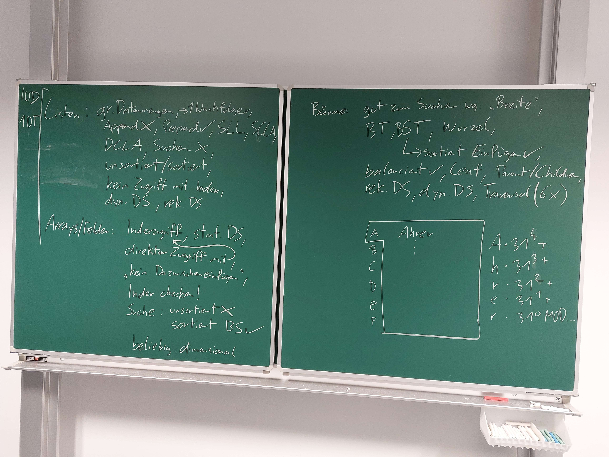

# Algorithmen und Datenstrukturen

## 29.2.2024

### Lehrplan

Hash und String Zeugs

Compilerbau, Gramatikanalyse

Objektorientiertes Programmieren

### Programme

3D Druck Simulation

Excel

### Suchalgorithmen

sequenzielle Suche O(n)
binäre Suche O(log n)

Ziel O(1)

Hashing

Schlüssel wird auf Inex in einem Array gemappt.(z.B. Modulo).

Kolisionen werden mithilfe von verkettung(jeder hashtabelleneintrag ist eine liste in der ich weitersuchen muss)

O Notation ist abhängig von der Hashmap Grö�e

Laufzeit vs. Speicherplatz

Offener Speicherbereich braucht Delete Flag

Vorsicht bei auswahl der hash methode

### Suchen in Zeichenketten

Einfache Lösung Drüberiterieren = O(n*m)

O(n+m) existiert

## 7.3.2024

### Datenkapselung

Module geben dem User nur die Proceduren die er benutzen dar zur verfügung, alle inneren Vorgänge und Datenstrukturen sind versteckt. wie private/public.

Verfügbare Procedures sind im Interface hinterlegt.

In pascal werden dazu Units verwendet. In einem Unit gibt es einen Implementierungs Teil und einen Interface Teil. Wenn sich etwas in der Implementierung �ndert muss man den Code der das Interface nutzt nicht ändern.

Man kann im Interface auch typen deklarieren.

Abstrakt => nicht direkt implementiert

## 8.3.2024

### Entwurf

Je mehr Gedanken um den Entwurf man sich vor der Implementierung macht, desto weniger Gedanken muss man sich nach der Implementierung machen.

Abstraktion, herunterbrechen herunterbrechen herunterbrechen.

#### Entwurfsebenen

Subsysteme mit schwacher Kopplung. Kommunizieren über Dateien, Datenbanken und Netzwerke

Diese bestehen aus Modulen mit enger Kopplung die über Aufrufschnittstellen kommunizieren.

Dies kann man noch auf einzelne Algorithmen zerbrechen.

Bespiel:

Compiler erzeugt aus .pas ein .o file, Linker erstellt daraus eine .exe.

Der Compiler wiederum besteht aus den Modulen Scanner, Parser, Symboltabelle und CodeGenerator. Der Scanner lest zeichen ab dem "BEGIN" ein, der Parser wertet die Gültigkeit aus und speichert Variablen in die Symboltabelle und der CodeGenerator erzeugt aus dem Code das Programm.

#### Zerlegungsarten

Man kann eine Anforderung auf 3 Weisen verbessern, je nach Anforderung gibt es gewisse Vor und Nachteile für jede Art.

Aufgabenorientiert.

Datenorientiert.

Objektorientiert.

#### Beispiel mit 3D Drucker

Parser

Instruktionen Speichern

Koordinaten definieren

Darstellung

Gerade linien

Kurven

in Schritte brechen

Validation der Instruktionen

Nutzeroberfläche

Linie Zeichen

Drucker zeichen

Editor

## 9.3.2024

Alle Ã?bungen machen.

### Hash table

#### List vs Array vs Tree

List vs Array vs Tree => Hashtable gewinnt

#### Hashen

kleines delta a => groÃ?es delta b

möglichst gleiche Verteilung

### Zeichenketten suchen

## Übungen

### UE1

Zuerst muss eine string GetHashCode Funktion in einem Unit erstellt werden, diese rechnet einen Hashcode aus dem Ordinalwert eines chars und seiner Position aus, indem die Summe jedes Ordinalwertes mal 31 hoch der Position. Dieser Hasing Algorithmus wurde in der Übung kurz als die Lösung die Java verwendet angeschnitten.

Für die zwei verschiedenen Hash-Tabellen Arten werden 2 verschiedene Units(ChainedWordCounter und OpenAdressedWordCounter).

Das Hinzufügen der Wörter und die Kollisionsvermeidung wird gleich der Übung gemacht, wobei verschiedene Hashtabellengrößen getestet werden(die offen Adressierte Variante hat eine Untergrenze an gültiger Größe. Für die Testfälle wird eine Tabelle mit Zeiten erstellt um den Einfluss der Größe zur Laufzeit zu zeigen, weiters wird auch der genutzte Heap mittels heaptrc gezeigt.

Um die mehrfach vorkommenden Wörter zu zählen müssen zu jedem Wort die Anzahl an Vorkommnisse gespeichert werden. Dadurch kann später über alle Worte itteriert werden, um alle einmal vorkommenden Worte zu finden, die überbliebenen Worte zu Zählen und das Maximum zu finden.

Timer.pas wurde nicht verändert, in WordReader.pas wurde WinCrt entfernt, um das Unit Linux kompatibel zu machen, und der Word Datentyp wurde auf WordString geändert um Namenskonflikte mit dem Pascal Datentyp Word zu verhindern.

Per KI Richtlinie gebe ich bekannt CoPilot zu verwenden, wobei es zur Formatierung und als Autocomplete genutzt wurde.

Stunden 9

### UE2
